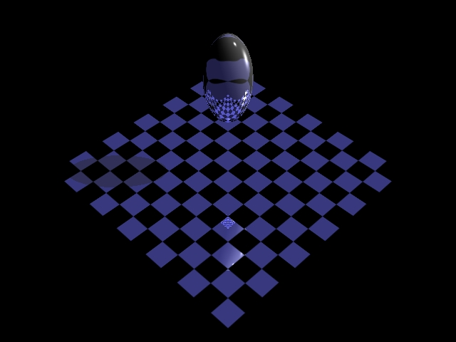

# Run the following to create a jpeg file:

`make -f Makefile2` from root
- Creates the RayTracer executable

`./RayTracer --in RayFiles/test.ray --out RayFiles/test.jpeg`
- Runs the RayTracer executable on the test.ray file and outputs the result as test.jpeg in the RayFiles directory

### The following should render RayFiles/test.jpeg:

# To clean up project structure
`make clean`
- Cleans executables and object files
